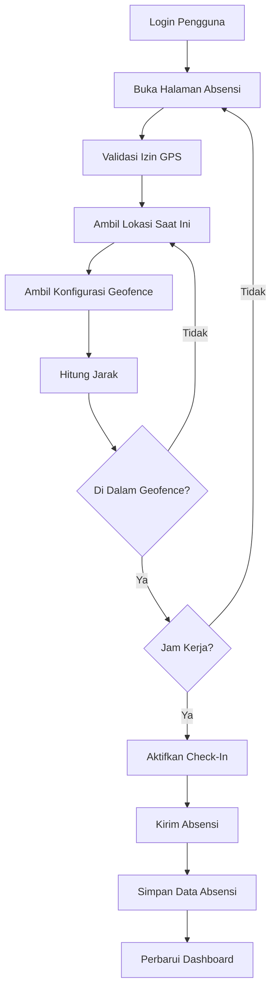

<div align="center">

# DailyCheck

### Sistem Cerdas Absensi dan Monitoring Magang

DailyCheck adalah sistem absensi dan monitoring magang berbasis lokasi yang dibangun dengan **Flutter** dan **Laravel**. Aplikasi ini memvalidasi setiap catatan kehadiran melalui **Pelacakan GPS**, **Verifikasi Geofence**, **Validasi Jadwal Kerja**, dan **Alur Persetujuan Berbasis Peran** untuk memastikan absensi yang akurat, transparan, dan akuntabel.

Dirancang untuk meminimalkan kecurangan absensi sekaligus memberikan administrator dan pembimbing kemampuan monitoring real-time dan manajemen absensi yang terpusat.


</div>


---

# Ringkasan

DailyCheck adalah sistem absensi digital dan monitoring magang yang dikembangkan untuk meningkatkan efisiensi dan keandalan manajemen absensi magang.

Berbeda dengan sistem absensi konvensional yang hanya mencatat cap waktu, DailyCheck melakukan berbagai proses validasi sebelum mengizinkan pengguna melakukan check-in atau check-out. Setiap aktivitas absensi diverifikasi menggunakan lokasi GPS peserta saat itu, area geofence yang ditetapkan, jadwal kerja, dan hak akses sistem.

Sistem ini juga menyediakan perangkat administrasi terpadu untuk manajemen peserta, monitoring absensi, persetujuan izin, koreksi absensi, pelaporan, dan pencatatan audit. Dengan menggabungkan seluruh komponen ini dalam satu platform, DailyCheck membantu organisasi menjaga keakuratan catatan absensi sekaligus menyederhanakan pengawasan magang.

---

# Latar Belakang

Banyak organisasi masih mengelola absensi magang dengan metode manual atau semi-digital seperti:

- Lembar absensi kertas
- Pemindaian kode QR
- Google Forms
- Aplikasi pesan instan

Meskipun pendekatan ini mudah diterapkan, cara-cara tersebut sering menimbulkan berbagai masalah operasional, di antaranya:

- Kecurangan absensi
- Absensi jarak jauh di luar tempat kerja
- Manipulasi waktu absensi
- Kesulitan dalam memantau peserta
- Pelaporan absensi yang memakan waktu

DailyCheck dikembangkan untuk mengatasi tantangan tersebut melalui sistem absensi berbasis lokasi yang didukung validasi otomatis dan monitoring terpusat.

---

# Tujuan

Tujuan utama DailyCheck adalah:

- Memastikan absensi hanya dapat dilakukan di lokasi yang sah.
- Mencegah manipulasi absensi melalui validasi GPS dan geofence.
- Memverifikasi absensi sesuai jadwal kerja yang telah ditentukan.
- Menyederhanakan administrasi absensi magang.
- Menyediakan monitoring absensi secara real-time.
- Menjaga riwayat absensi secara lengkap melalui pencatatan audit.
- Menghasilkan laporan absensi yang akurat.

---

# Fitur Utama

- Absensi berbasis GPS
- Validasi geofence
- Validasi jadwal kerja
- Check-in dan Check-out
- Pengajuan izin dan sakit
- Alur persetujuan absensi
- Koreksi absensi (override)
- Audit log
- Monitoring absensi real-time
- Pelaporan absensi
- Manajemen pengguna
- Manajemen unit kerja

---

# Alur Sistem

DailyCheck memvalidasi beberapa kondisi sebelum mengizinkan peserta mencatat absensi.

Alur keseluruhan digambarkan sebagai berikut.



---

# Proses Validasi Absensi

Sebelum peserta diizinkan melakukan Check-in atau Check-out, sistem memvalidasi beberapa kondisi berikut.

## Autentikasi

Setiap pengguna harus melakukan autentikasi menggunakan akun yang valid.

Peran pengguna yang terautentikasi menentukan fitur dan sumber daya apa saja yang dapat diakses dalam aplikasi.

Peran yang didukung meliputi:

- Administrator
- Pembimbing
- Peserta Magang

---

## Validasi GPS

Aplikasi memverifikasi bahwa:

- Layanan lokasi telah diaktifkan.
- Izin lokasi telah diberikan.
- Posisi GPS saat ini dapat diambil dengan berhasil.

Absensi tidak dapat dilanjutkan apabila salah satu syarat di atas tidak terpenuhi.

---

## Validasi Geofence

Setelah lokasi saat ini diperoleh, aplikasi menghitung jarak antara posisi peserta dan area geofence tempat kerja yang ditetapkan.

Jika jarak yang dihitung melebihi radius yang dikonfigurasi, aksi absensi tetap tidak dapat digunakan.

---

## Validasi Jadwal Kerja

Absensi juga divalidasi berdasarkan jadwal kerja yang dikonfigurasi.

Sistem memverifikasi:

- Hari kerja
- Jadwal check-in
- Jadwal check-out

Absensi hanya diizinkan dalam periode absensi yang telah dikonfigurasi.

---

## Pencatatan Absensi

Ketika seluruh proses validasi berhasil, catatan absensi dikirim ke backend.

Informasi yang dicatat meliputi:

- Waktu check-in
- Waktu check-out
- Koordinat GPS
- Jarak geofence
- Status kehadiran
- Unit kerja yang ditetapkan
- Informasi perangkat
- Cap waktu

Backend melakukan validasi tambahan sebelum menyimpan data ke dalam basis data.

---

## Sinkronisasi Dashboard

Informasi absensi disinkronkan secara berkala menggunakan polling untuk memastikan administrator dan pembimbing selalu menerima status peserta terbaru.

---

## Alur Pengajuan Izin

Peserta dapat mengajukan izin atau izin sakit langsung melalui aplikasi.

Setiap pengajuan ditinjau oleh pembimbing yang ditugaskan sebelum disetujui atau ditolak.

Riwayat persetujuan lengkap disimpan untuk keperluan referensi di kemudian hari.

---

## Koreksi Absensi (Override)

Pembimbing dapat memperbarui catatan absensi dalam keadaan tertentu, seperti kegagalan GPS, gangguan koneksi, atau koreksi administratif.

Setiap perubahan dicatat dalam Audit Log untuk menjaga akuntabilitas dan riwayat absensi yang lengkap.

---

# Peran Pengguna

## Administrator

Bertanggung jawab atas pengelolaan sistem secara keseluruhan.

Kemampuan meliputi:

- Manajemen pengguna
- Manajemen unit kerja
- Konfigurasi geofence
- Konfigurasi jadwal kerja
- Persetujuan pendaftaran
- Monitoring absensi
- Pembuatan laporan

---

## Pembimbing

Bertanggung jawab mengawasi peserta magang.

Kemampuan meliputi:

- Monitoring absensi
- Persetujuan izin
- Persetujuan izin sakit
- Koreksi absensi

---

## Peserta Magang

Bertanggung jawab mencatat absensi harian dan mengelola informasi absensi pribadi.

Kemampuan meliputi:

- Check-in
- Check-out
- Riwayat absensi
- Pengajuan izin
- Pengajuan izin sakit
- Manajemen profil

---

# Arsitektur Sistem

```text
               Aplikasi Mobile Flutter
                         │
                         │ HTTPS REST API
                         ▼
                Layanan Backend Laravel
                         │
                 Lapisan Logika Bisnis
                         │
                         ▼
                   Basis Data MySQL
```

---

# Struktur Proyek

```text
DailyCheck
│
├── lib/
│   Kode sumber aplikasi Flutter
│
├── backend_laravel/
│   REST API Laravel
│
├── backend/
│   Layanan backend lama (legacy)
│
├── deploy/
│   Konfigurasi deployment
│
├── android/
├── ios/
├── linux/
├── macos/
└── windows/
```

---

# Teknologi yang Digunakan

| Lapisan | Teknologi |
|--------|------------|
| Aplikasi Mobile | Flutter |
| Backend | Laravel |
| Basis Data | MySQL |
| Arsitektur | MVVM |
| Komunikasi | REST API |
| Deployment | Nginx |

---

# Pengembangan ke Depan

Peningkatan berikut direncanakan untuk rilis mendatang:

- Pengenalan wajah untuk verifikasi absensi (jika di perlukan)
- Layanan push notification
- Monitoring lokasi secara live
- Dashboard administrasi berbasis web
- Analitik absensi
- Peta panas (heatmap) absensi
- Manajemen pengunjung (visitor management)

---

# CATATAN

DailyCheck dikembangkan sebagai sistem absensi dan monitoring magang untuk mendukung transformasi digital dalam manajemen absensi melalui validasi lokasi yang akurat, alur persetujuan yang terstruktur, dan monitoring yang terpusat.
